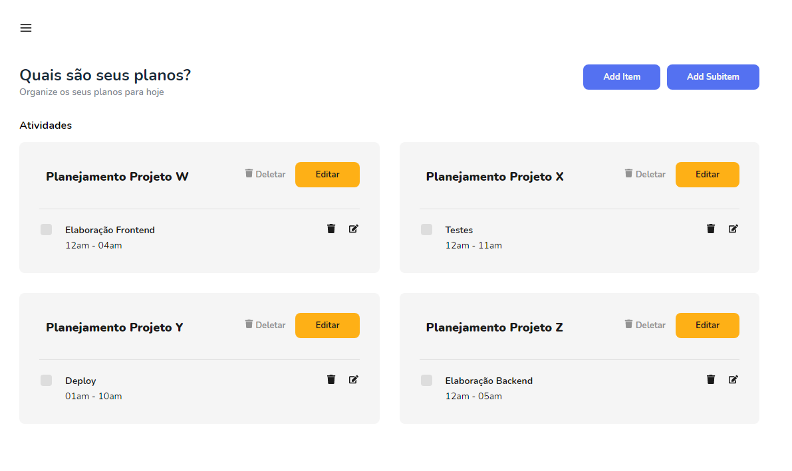

<h1 align="center">
  ToDo List 📋
</h1>

<h4 align="center">
  Vamos organizar seus planos para hoje? 💬
</h4>

  <a href="#computer-projeto">Projeto</a>&nbsp;&nbsp;&nbsp;|&nbsp;&nbsp;&nbsp;
  <a href="#date-avaliação-do-escopo">Avaliação do escopo</a>&nbsp;&nbsp;&nbsp;|&nbsp;&nbsp;&nbsp;
  <a href="#alarm_clock-estimativas">Estimativas</a>&nbsp;&nbsp;&nbsp;|&nbsp;&nbsp;&nbsp;
  <a href="#ghost-tecnologias">Tecnologias</a>&nbsp;&nbsp;&nbsp;|&nbsp;&nbsp;&nbsp;
  <a href="#rocket-iniciando-aplicação">Iniciando aplicação</a>&nbsp;&nbsp;&nbsp;|&nbsp;&nbsp;&nbsp;
  <a href="#computer-web">Web</a>

 

  

## :computer: Projeto

O ToDo List é uma aplicação utilizada para organizar as atividades de acordo com o seu status e assim guiar o usuário a se planejar de acordo com suas pendências.

## :date: Avaliação do escopo

Fiquei com uma dúvida durante o desenvolvimento em relação a funcionalidade de um subitem virar um item mas que obtive um retorno rápido no contato e as dúvidas foram sanadas, dessa forma, o escopo ficou claro e coerente.

## :alarm_clock: Estimativas

- Com início de desenvolvimento em 25/06/2021, o projeto será entregue até dia 02/07/2021.

- :art: Frontend

- [x] Avaliação do escopo e analise para estimativas `1,0h`
- [x] Criação inicial do projeto e ambiente `1,0h`
- [x] Tela Dashboard `2,0h`
- [x] Tela Sobre `0,5h`
- [x] CRUD Item
  - [x] Criar um item `1h`
  - [x] Editar um item existente `1h`
  - [x] Apagar um item existente `1h`
  - [ ] Organizar o item como subitem de um item existente `6,0h`
  - [ ] Ao entrar com uma URL qualquer, a mesma deve ser usada para se referenciar a um novo ToDo List `1,0h`
- [x] CRUD Subitem
  - [x] Criar um subitem `1h`
  - [x] Editar um subitem existente `1h`
  - [x] Apagar um subitem existente `1h`
  - [x] Atualizar status de um subitem existente `1h`
  - [x] Mover um subitem de um item pai X para outro item pai Y `6,0h`
  - [x] Mover um subitem para fora do item pai, transformando-o em um outro item pai `2,0h`
- [ ] Compartilhar TODO `1,0h`
  - [ ] Como usuário gostaria de compartilhar a URL do ToDo que estou editando por email para uma ou mais pessoas `2h`
- [ ] Teste de regressão `2h`
- [ ] Ajustes erros encontrados no teste de regressão `2h`
- [x] Responsividade `1,0h`
- [ ] Deploy `1,0h`

- 🚪 Backend

- [x] Estrutura `1,0h`
- [x] CRUD Item
  - [x] Listar itens `0,5h`
  - [x] Criar um item `0,5h`
  - [x] Editar um item existente `0,5h`
  - [x] Apagar um item existente `0,5h`
- [x] CRUD Subitem
  - [x] Criar um subitem `0,5h`
  - [x] Visualizar subitem `0,5h`
  - [x] Editar um subitem existente `0,5h`
  - [x] Editar o status de um subitem existente `0,5h`
  - [x] Editar o id do item de um subitem existente `0,5h`
  - [x] Apagar um subitem existente `0,5h`
- [ ] Testes `2,0h`
- [ ] Deploy `1,0h`

## :ghost: Tecnologias

Esse projeto foi desenvolvido com as seguintes tecnologias:

- [React.js](https://pt-br.reactjs.org/)
- [react-dnd](https://react-dnd.github.io/react-dnd/)
- [Node.js](https://nodejs.org/en/)
- [AdonisJS v4](https://legacy.adonisjs.com/)
- [Postgres](https://www.postgresql.org/)
- [Docker](https://docs.docker.com/)

## :rocket: Iniciando aplicação

- Clone este repositório usando `git clone http://git.vibbra.com.br/brenda-1624633177/todo-list-api.git`;
- Mova-se para diretório da aplicação: `cd todo-list-api`;
- Execute `yarn install` ou `npm install` para instalar as dependências;
- Crie seu container com `docker run --name database -e POSTGRES_PASSWORD=postgres -p 5432:5432 -d postgres`;
- Suba o container: `docker start database`;
- Crie um arquivo .env através do `.env.example` e configure com seus respectivos dados;
- Instale o AdonisJs caso necessário: `npm i -g @adonisjs/cli`;
- Execute o seguinte comando para executar as migrações: `adonis migration:run`;
- Gere a chave da sua aplicação: `adonis key:generate`;
- Inicie a aplicação: `adonis serve --dev`;

## :computer: Web

- Aplicação web disponível em: <a href="http://git.vibbra.com.br/brenda-1624633177/todo-list.git">Web</a>

---

### <a href="https://www.linkedin.com/in/brenda-matias/">LinkedIn</a>
